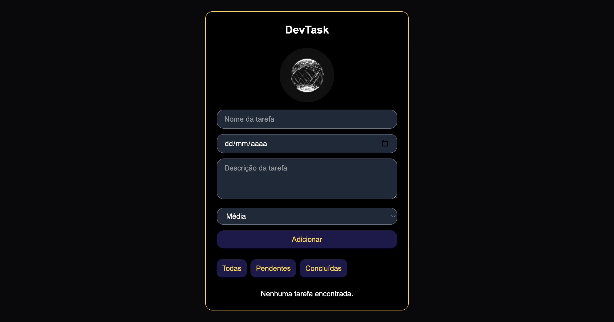
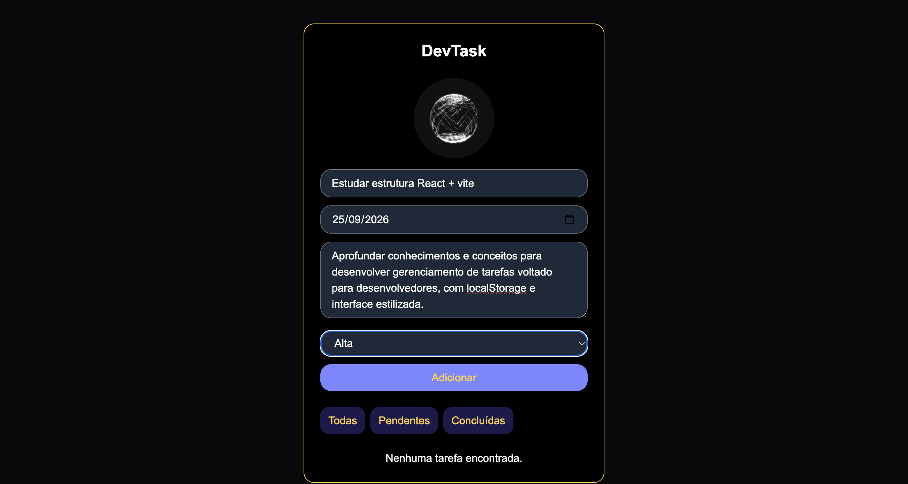
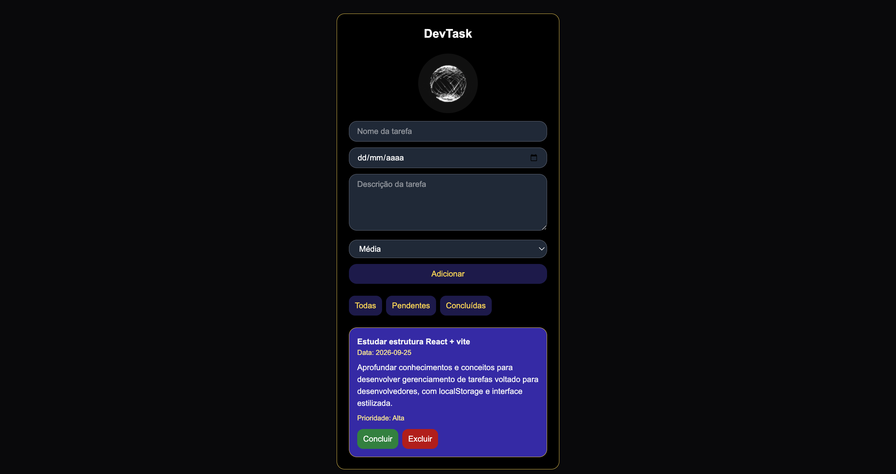

<div align="center">

# DevTask


> Gerenciador de tarefas desenvolvido em React

> Com o propósito de desenvolver na prática um sistema que auxilia na organização de tarefas com conceitos aprendidos em aula

</div>

## 📌 Sobre o projeto

O **DevTask** é uma aplicação web desenvolvida durante a disciplina de Web Development da **FIAP**, com o objetivo de aplicar conceitos do desenvolvimento de interfaces utilizando React.

A aplicação permite criar, visualizar, concluir, desfazer e excluir tarefas, além de possibilitar a filtragem entre tarefas pendentes e concluídas.

---

## 🚀 Funcionalidades

- ➕ Adição de novas tarefas
- 📅 Definição de data
- 📝 Descrição da tarefa
- ⚡ Definição de prioridade
- ✅ Conclusão de tarefas
- ↩️ Desfazer conclusão
- 🗑️ Exclusão de tarefas
- 🔎 Filtro entre:
  - Todas
  - Pendentes
  - Concluídas
- 💾 Persistência dos dados utilizando `localStorage`
- 📱 Interface responsiva
- 🎨 Feedback visual para tarefas concluídas
- 🌐 Deploy automatizado com GitHub Actions

---

## 🧠 Conceitos aplicados

Durante o desenvolvimento foram utilizados conceitos importantes do React e JavaScript:

### React

- `useState`
- `useEffect`
- Componentes
- Props e eventos
- Renderização de listas
- Renderização condicional

### JavaScript

- Arrow Functions
- Objetos
- Arrays
- `map()`
- `filter()`
- Operador Spread (`...`)
- Operadores condicionais
- `JSON.stringify()`
- `JSON.parse()`

### Armazenamento

O projeto utiliza o `localStorage` do navegador para manter as tarefas salvas mesmo após o usuário atualizar ou fechar a página.

---

## 🛠️ Tecnologias

- React
- Vite
- JavaScript
- Tailwind CSS (Método direto de estilização explorado em aula)
- CSS3
- Git
- GitHub
- GitHub Actions
- GitHub Pages

---

## 📂 Estrutura do projeto

```text
devtask/
├── public/
│   ├── samurai.png
│   ├── system.gif
│   └── ...
│
├── src/
│   ├── components/
│   │   └── Tarefa.jsx
│   │
│   ├── css/
│   │   └── estilo.css
│   │
│   ├── App.jsx
│   ├── index.css
│   └── main.jsx
│
├── .github/
│   └── workflows/
│       └── deploy.yml
│
├── index.html
├── package.json
├── vite.config.js
└── README.md
```

## 🖥️ Demonstração


### Tela Inicial

Tela principal simples e intuitiva para o usuário Criar e Gerenciar suas tarefas.



### Criação de Tarefas

Campos disponíveis para o usuário preencher os seguintes campos para criar suas listas de tarefas: "Nome, Data, Descrição e Prioridade"



### Organização e gerenciamento das Tarefas

Após os campos preechidos, a tarefa é adicionada e organizada na seção abaixo onde o usuário poderá gerenciar, filtrar tarefas, concluir, desfazer a ação e excluir caso desejado.



## 👨‍💻 Desenvolvido por e para
- Alyson Souto
- Checkpoint 4 - Web Development - FIAP

## 🌐 Link's

GitHub:
https://github.com/alyson-souto

LinkedIn: 
https://www.linkedin.com/in/alyson-souto-739039314/

Deploy - Visite e Experencie a funcionalidade do projeto:
https://alyson-souto.github.io/devtask-cp4-web-development/